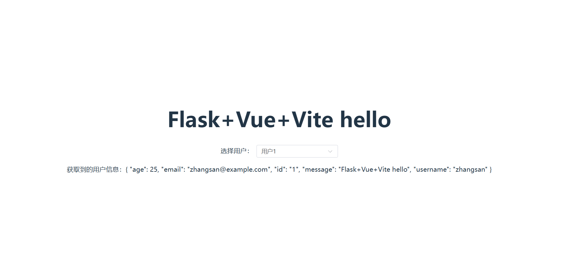

# vue_flask_template

一个前台使用 vite+vue，后台使用 flask 的开发环境模板

## 下载使用方法

> 1.下载源码

- 前置条件
  - 安装 Node.js，安装完成后，通过命令行运行 node -v 和 npm -v 检查是否安装成功。
  - 安装 Python，安装完成后，通过命令行运行 python --version 检查是否安装成功。

```bash
git clone git@gitee.com:tokukin/vue_flask_template.git
```

> 2.配置前台

```bash
#进入前台目录
cd .\vue_flask_template\myapp-frontend\
#安装npm依赖
npm install
#测试项目
npm run dev
#正常访问http://localhost:5173/即成功
CTRL+C终止
```

> 3.配置后台

```bash
#进入后目录
cd ..\myapp-backend
#配置python虚拟环境
python -m venv .venv
#激活虚拟环境
.venv\Scripts\activate
#安装依赖
pip install -r requirements.txt
#测试项目
python run.py
#http://127.0.0.1:5000/api/user/info?user_id=1
#正常访问链接即可
CTRL+C终止
```

> 4.整体测试

```bash
#在myapp-backend目录下运行
python run.py
# http://127.0.0.1:5000/api/user/info?user_id=1
# 正常访问链接
# 在myapp-frontend目录下运行
npm run dev
# http://localhost:5173/
# 正常访问链接且可以点击选项卡即可

```



## 文件组织结构

```python
vue_flask_template
├── .gitignore      #git例外文件清单
├── LICENSE.txt     #开源协议
├── README.md       #readme
|
├── myapp-backend   #后台文件根目录
│ ├── app           # 主应用目录（核心代码）
│ │ ├── **init**.py # 应用初始化（创建 Flask 实例、注册蓝图、配置 CORS 等）
│ │ ├── api         # 接口模块目录（按业务拆分）
│ │ │ ├── **init**.py
│ │ │ └── user.py
│ │ └── services    # 业务逻辑层（可选，抽离复杂逻辑）
│ │   ├── **init**.py
│ │   └── user_service.py
│ ├── config.py     # 配置文件（如数据库地址、调试模式开关）
│ └── run.py        # 项目启动入口（运行 Flask 应用）
|
└── myapp-frontend  #前台文件根目录
├── index.html
├── package.json
├── pnpm-lock.yaml
├── public
│ └── vite.svg
├── src
│ ├── App.vue
│ ├── assets
│ │ └── vue.svg
│ ├── components
│ │ └── HelloWorld.vue
│ ├── main.ts
│ ├── services
│ │ └── DataService.ts
│ ├── shims-vue.d.ts
│ └── style.css
├── tsconfig.app.json
├── tsconfig.json
├── tsconfig.node.json
└── vite.config.ts
```
